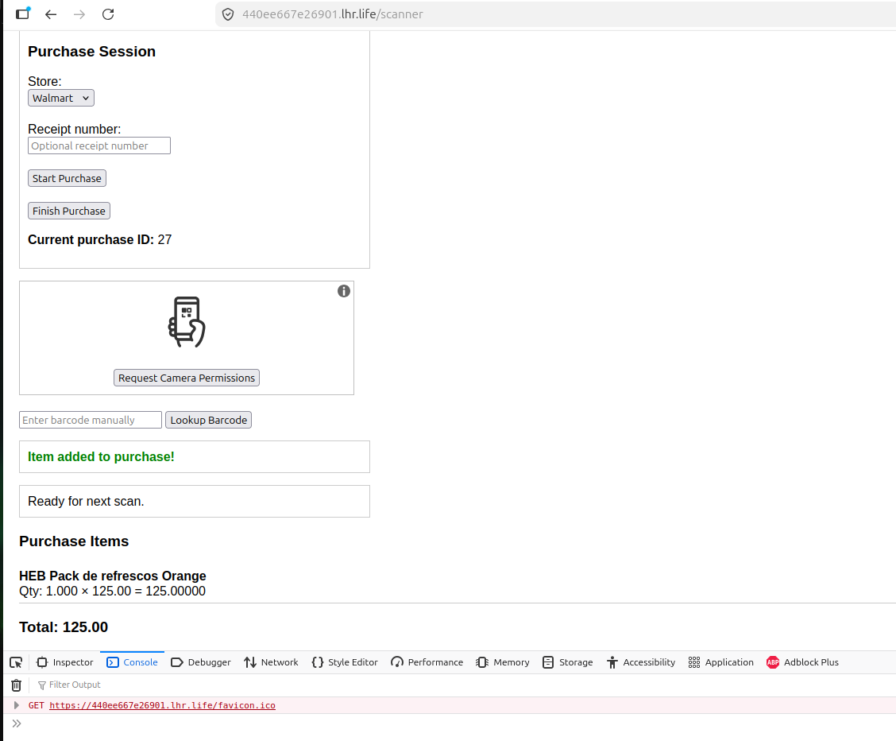
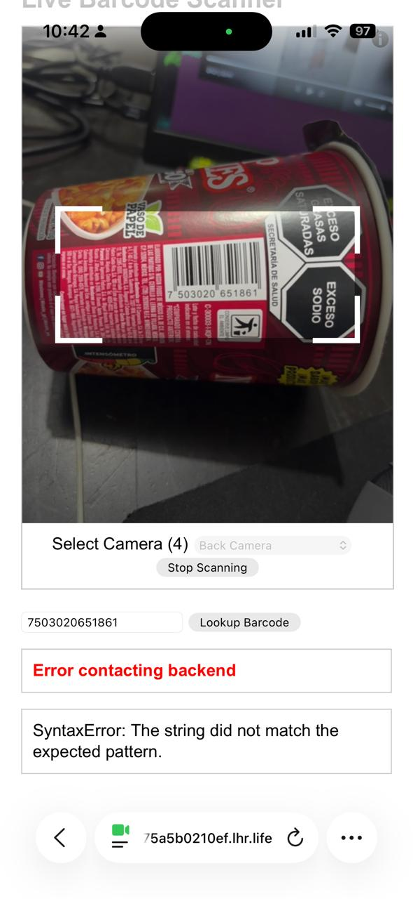
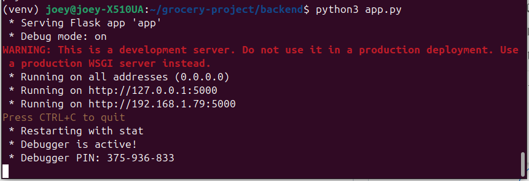
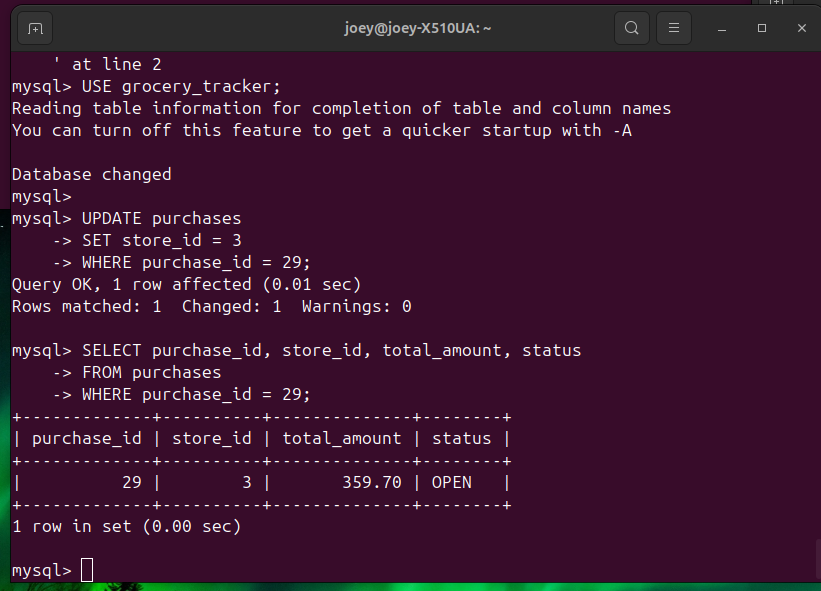
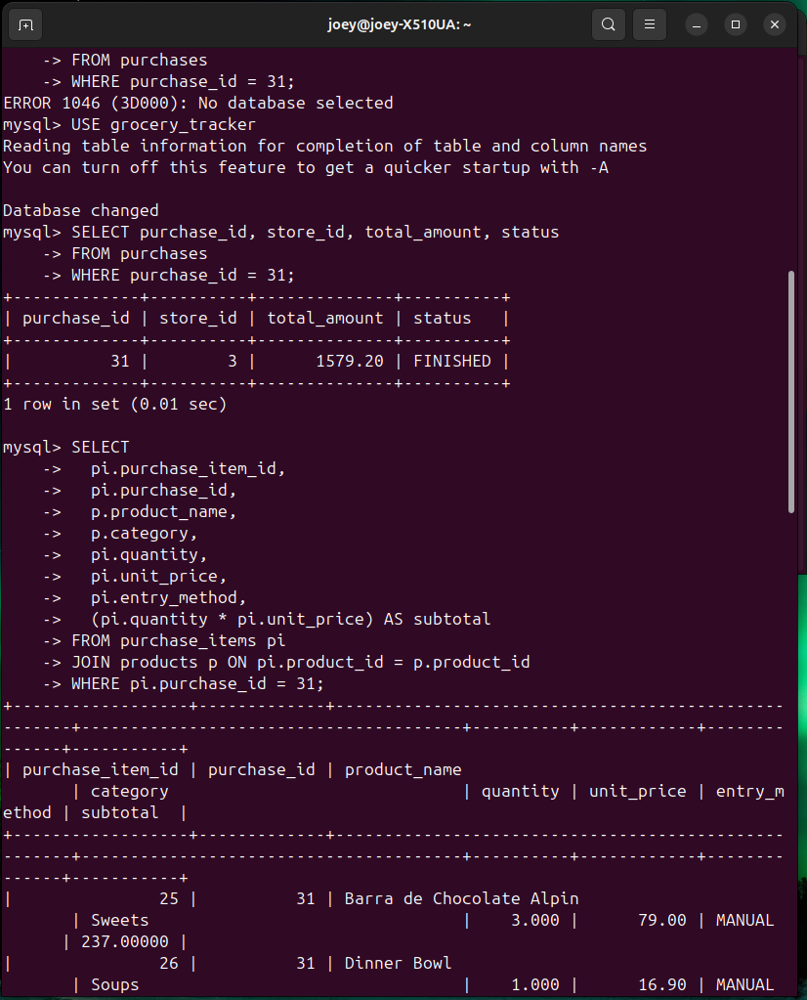
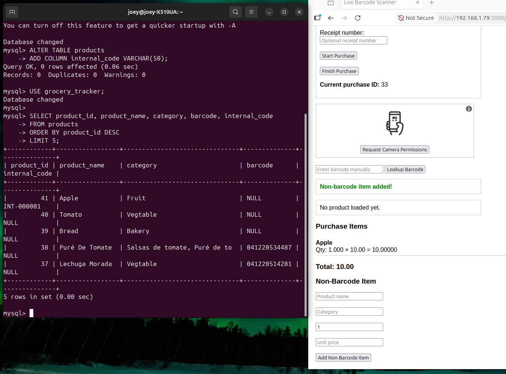
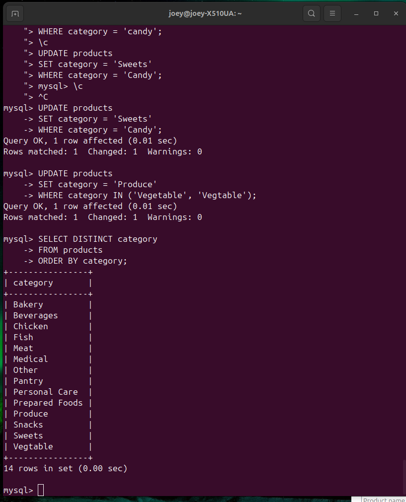

# Grocery Inventory Capture Prototype

A barcode-based grocery inventory prototype built with Python Flask, MySQL, HTML, CSS, and JavaScript.

## Purpose

This project explores how barcode scanning, database storage, and API communication can support lightweight inventory capture and traceability workflows.

## Tech Stack

- Python
- Flask
- MySQL
- HTML
- CSS
- JavaScript

## Basic Architecture

Mobile / Browser Scanner  
→ Frontend Interface  
→ Flask Backend API  
→ MySQL Database

## Current Features

- Barcode scanning interface
- Product registration
- MySQL product storage
- Backend API connection
- Basic inventory capture workflow

## Future Improvements

- Purchase/replenishment module
- Supplier integration
- Inventory movement history
- Analytics dashboard
- User authentication

## Lessons Learned

- Built a basic barcode-based inventory capture workflow.
- Connected a browser/mobile scanning interface to a Flask backend.
- Stored product information in a MySQL database.
- Learned the importance of separating code from credentials.
- Practiced Git and GitHub version control for project documentation.
- Identified future expansion areas such as purchasing, supplier management, and inventory movement history.

## Screenshots

### Scanner Interface

### Mobile Scanner Interface

### Backend API Running

### MySQL Purchase Table

### MySQL Select Table

### MySQL Scanner Register

### MySQL Category Table

 
